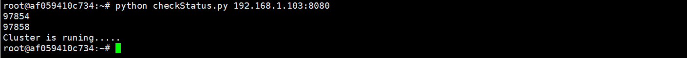

# Ammolite Client Docker Container

- [Ammolite Client Docker Container](#ammolite-client-docker-container)
  - [1. What Is Ammolite](#1-what-is-ammolite)
  - [1.1. Why Ammolite](#11-why-ammolite)
  - [2. Prerequisites](#2-prerequisites)
  - [3. The Package](#3-the-package)
    - [3.1.  Pre-generated Transactions](#31--pre-generated-transactions)
    - [3.2. Structure](#32-structure)
  - [4.  Work with the Client Container](#4--work-with-the-client-container)
    - [4.1. Start the Client Container](#41-start-the-client-container)
    - [4.2. Container Login](#42-container-login)
    - [4.3 Connect to Arcology](#43-connect-to-arcology)
  - [5. Showcases](#5-showcases)
  - [6. Transaction Files](#6-transaction-files)
  - [7. Note](#7-note)

## 1. What Is Ammolite

[Ammolite](https://github.com/arcology-network/ammolite) is Arcology's network client package written in Python. It can interact with Arcology nodes through HTTP connections. Ammolite to Arcology is like web3.js to Ethereum.


## 1.1. Why Ammolite

Arcology supports all standard Ethereum RPC APIs. But the APIs lack the ability to handle batch data. Ammolite is specifically built for that purpose. It can send in millions of transactions to the network in seconds.

## 2. Prerequisites

The client docker is pretty much self-contained. You only the following items in place:

- [A live Arcology testnet](./testnet-deployment-comparison.md)
- Docker engine

## 3. The Package

The package consists of two major parts.

- A client docker container
- Pre-generated transactions for benchmarking

### 3.1.  Pre-generated Transactions

The stand Arcology releases contain some pre-generated transaction files that can be used directly in testing. There files are not part of the client docker. You will need to get them from the installer package.

Download the latest installer, uncompress the package to a location of your choice, the folder structure should look like the below. There is a folder named `./testnet-installer/txs`, which contains all the pre-generated transaction files. **You will need to mount the folder to the client docker to continue the test.**


### 3.2. Structure

The docker container image contains the following files and folders.

- blockmon.py: Realtime blockchain monitor
- checkStatus.py: Script file to check the testnet status
- data: Data folder for transaction files
- ds_token: Scripts and data files for ds_token showcase  
- parallel_kitties Scripts and data files for the parallel CryptoKitties showcase  
- python: The last python executable
- sendtx.py: Send trasactions to testnet 
- sendtx.sh: Shell wrapper for sendtx.py
- tps.py: Realtime TPS observer
- uniswap: Scripts and data files for uniswap showcase  
- utils.py: Utility tools

## 4.  Work with the Client Container

The Ammolite client container is in a docker container image. with all the necessary modules and libraries installed to compile the solidity smart contracts and to interact with an Arcology testnet.

### 4.1. Start the Client Container

The following command starts the client container and mount the transaction data folder. Replace the folder `/home/testnet-installer/txs` with the directory where your pre-generated transitions reside.

```shell
sudo docker run --name ammo -p 32768:22 -v /home/testnet-installer/txs:/root/data  -d arcologynetwork/ammolite /usr/sbin/sshd  -D
```

### 4.2. Container Login

Run the command to log in to the container. Simply **replace `192.168.1.103` with your host machine IP.**  Again, the host is the machine on which the client docker is running.

```shell
>ssh -p 32768 root@192.168.1.103
```

Use the credential below to log in to the client docker.

- Username:   **root**
- Password:   **frY6CvAy8c9E**

### 4.3 Connect to Arcology

In the client docker container, type in the command below to check if the client docker is successfully connected to an Arcology testnet. Replace the IP `192.168.1.103` with the Arcology Node IP that you are connected to.

```shell
>python checkStatus.py 192.168.1.103:8080
```

If you connect to the testnet from the Ammolite docker container image will see something like the below.



4.3 Send the Transactions

You will need to use `sendtxs.py` to load in a pre-generated transaction file and send transaction to an Arcology node through HTTP connections.

**Syntax:**

```sh
>python sendtxs.py [NODE_IP:8080] [TRANSACTION_FILES]
```

The command above calls th `sendtxs.py` to load a pre-generated transaction file and then send it to an Arcology node through port `8080`. -->

## 5. Showcases

There are a few applications that are available on Arcology testnet. These cases are part of the client docker, so you may run the directly without having to install them manually.

- [Parallel Kitties](https://github.com/arcology-network/parallel-kitties)
- [Parallel Dstoken](https://github.com/arcology-network/parallel-dstoken)
- [Uniswap v2](https://github.com/arcology-network/uniswap-testing)
- [Parallel Coin Transfer](https://github.com/arcology-network/uniswap-testing)

## 6. [Transaction Files](https://github.com/arcology-network/presigned-transactions)

## 7. Note

>Please wait for one script to complete before starting the next one. The best way to tell is to look at the number of transactions contained in the latest block. Once the system has processed all transactions, the number drops back to zero.
